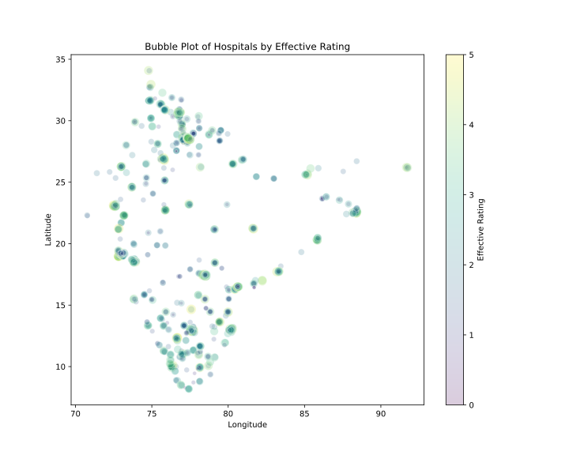
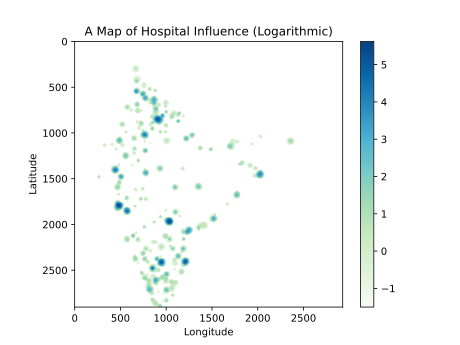
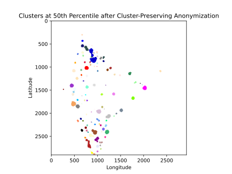
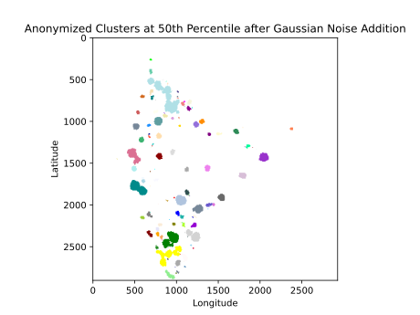

[](https://doi.org/10.5281/zenodo.17645083)
# Towards Medical Equity
_Hospital Location Anonymization Pipeline_

A Python pipeline for collecting, processing, and anonymizing hospital location data while preserving spatial clustering patterns.

## What This Does

This repository contains the complete data processing pipeline that:

1. **Extracts hospital data** from PDF sources and web scraping
2. **Calculates influence metrics** based on ratings and review counts  
3. **Identifies natural clusters** of hospitals by geographic influence
4. **Applies cluster-preserving anonymization** to protect location privacy
5. **Generates anonymized datasets** suitable for research and analysis

## Pipeline Overview

Run the scripts in sequence:

```bash
python code/1-pdf-extract.py          # Extract hospitals from PDF
python code/2-scrape-maps.py          # Scrape ratings and coordinates  
python code/3-merge-reviews.py        # Merge review data
python code/4-scrape-coordinates.py   # Complete coordinate data
python code/5-post-process.py         # Clean and process data
python code/6-clustering-and-anonymization.py  # Generate clusters
python code/7-anonymize-fully.py      # Apply anonymization
python code/8-add-population-densities.py      # Add demographic data
```

## What we did different

Unlike traditional anonymization that adds random noise (destroying spatial patterns), our method identifies natural hospital clusters and constrains location shifts to stay within cluster boundaries. This preserves the geographic distribution needed for meaningful analysis while protecting individual facility privacy.

Our method achieves an **Earth Mover's Distance of 0.4002** vs. **1.3015** for naive randomization, demonstrating superior preservation of spatial patterns.

## Dataset

📊 **Anonymized Dataset**: [Hospitals in India](https://www.kaggle.com/datasets/fringewidth/hospitals-in-india) - *Kaggle*

## Repository Structure

```
├── code/           # Processing pipeline (scripts 1-8)
├── data/           # Raw and processed datasets
│   ├── main/       # Primary dataset versions  
│   ├── pdf/        # Source hospital list
│   └── temp/       # Intermediate files
└── fig/            # Visualization outputs
```

## Published Research

This code was developed as part of research published in IEEE on privacy-preserving geospatial data anonymization:

📄 **Paper**: [Privacy Preservation of Cluster Integrity on Web-Scraped Hospital Data](https://ieeexplore.ieee.org/document/10958977/)  
📊 **Slides**: [Research Presentation](https://hrishik.me/papers/pdf/Privacy_Preservation_of_Cluster_Integrity_on_Web-Scraped_Hospital_Data_SLIDES.pdf)  
🌐 **Summary**: [Project Overview](https://hrishik.me/papers/Anonymize-Hospital-Locations.html)

## Figures

| Stage | Visualization | Description |
|-------|---------------|-------------|
| **Data Collection** |  | Hospital locations sized by effective rating (combination of star rating and review count) |
| **Influence Mapping** |  | Logarithmic map showing hospital influence across India based on effective ratings |
| **Cluster Identification** |  | Natural hospital clusters identified from top 50% of influence values |
| **Our Method** |  | Clusters after our cluster-preserving anonymization method |
| **Naive Method** |  | Clusters after traditional random noise addition (note the distortion) |
| **Validation** |  | Original cluster magnitude distribution |
| **Validation** |  | Cluster magnitude distribution after our anonymization |
| **Validation** |  | Cluster magnitude distribution after naive anonymization |

---


